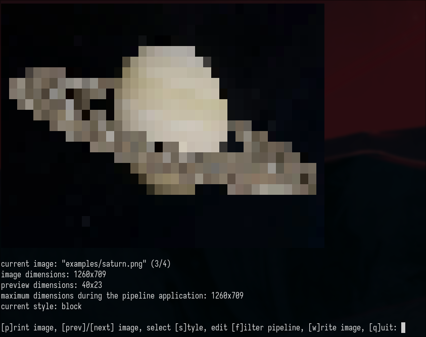

# artsciify

A program for applying filters to images on the command line.

Supports printing the resulting image in various styles to both standard output or a file.

### Usage

The program expects a file named `artsciify.conf` to be present in the program directory.

You can run it using `./artsciify <image> [<image> ...]`

